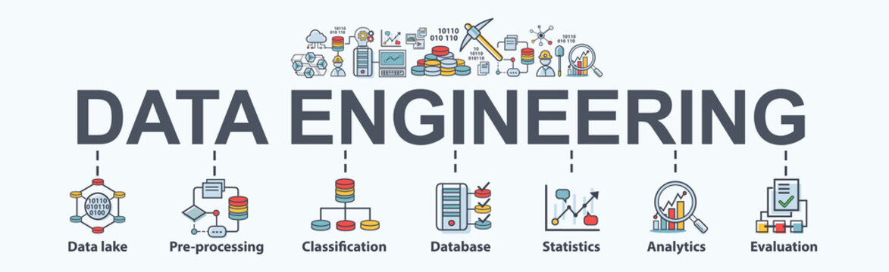

# Data Engineer Portfolio

## Intro
Hi, I'm Agustín Etcheverry, a Systems Information Engineer with a passion for data engineering. I'm currently working on a portfolio of projects that showcase my skills and experience in this field.

In this portfolio, you'll find projects that I've worked on in my free time.

I'm always looking for new challenges, so if you have any ideas for projects that I could work on, please let me know. I'm also open to feedback on my existing projects.

Thank you for taking the time to check out my portfolio!

## Projects

### Project 1: New York Taxi

This project was created as part of the Data Engineer Zoomcamp. The goal of the project was to build a data pipeline that ingests data from the NYC Taxi dataset, stores it in a data warehouse, and analyzes it to answer business questions.

The project was implemented using the following technologies:
* Google Cloud Platform
* Docker
* Google Looker Studio
* Terraform
* Prefect

I am proud of the work I did on this project and I believe it demonstrates my skills and experience in data engineering. I am confident that this project will be a valuable asset to my portfolio.

You can check more about this project [here](https://github.com/aguseche/data_engineer_projects/blob/main/project_1/README.md)