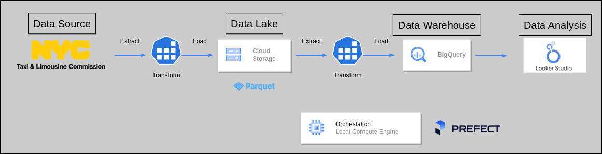
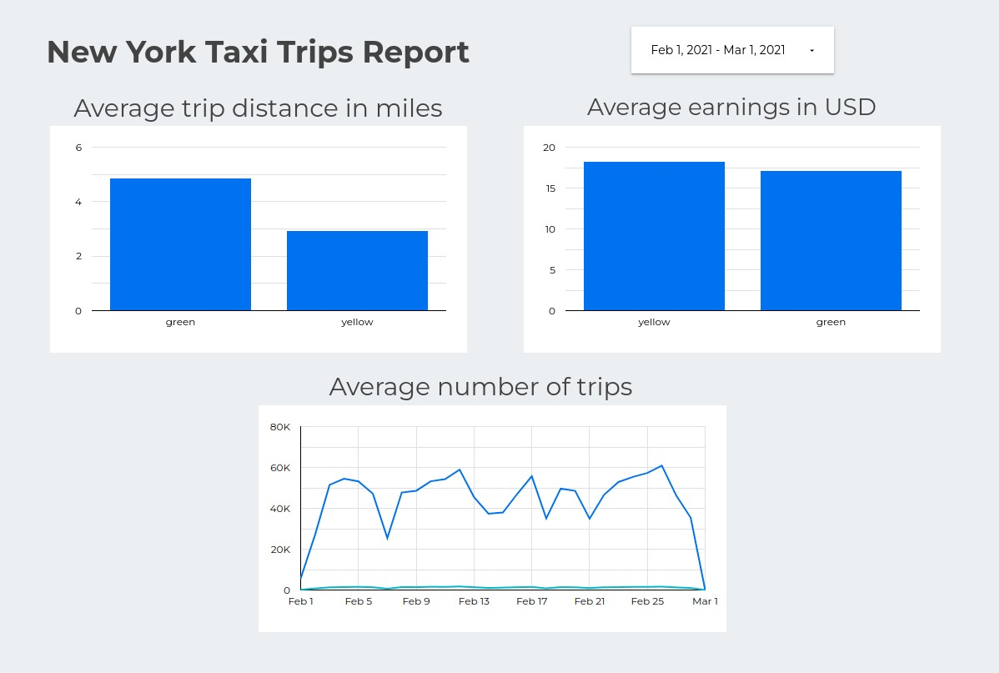

# Project 1
## Intro

This project was created as part of the [Data Engineering Zoomcamp](https://github.com/DataTalksClub/data-engineering-zoomcamp). The goal was to build a data pipeline that ingests data from the NYC Taxi dataset, stores it in a data warehouse, and analyzes it to answer business questions.

The project was implemented using the following technologies:
* Google Cloud Platform
* Docker
* Google Looker Studio
* Terraform
* Prefect

## Workflow

Firstly, i extract the files from the NYC Taxi dataset and load them in a Data Lake (GCS). 
Then, i add that data into a Data Warehouse (BigQuery). 
After some transformations made to the tables in BigQuery i created a connection from Google Looker Studio in order to retreive the data.
Finally, i gathered some businness requirements and created the charts needed to fulfill them.

I will be using Terraform to set up the infrastructure in GCP.

## Steps:
#### 1- Create a venv and install requirements.txt
#### 2- Set up terraform:
    -Using  main.tf and variables.tf 
    -Run the commands terraform init and terraform apply
#### 3- Use the ETL_2 folder to upload the data:
    -First run prefect orion start on the terminal to run prefect
    -Then with web_to_gcs.py (loads the data from the web into a Data Lake)
    -At Last with gcs_to_bg.py (loads the data from the Data Lake to BigQuery)
#### 4- Run the .sql queries located in the BigQuery folder
    - I do  this to simulate the week 4 of the zoomcamp, i didnt wanted to use dbt.
    - This could be done with some other pipelines but for simplification i did it this way.
#### 5- Visualize using Google Data Studio
    -Here are some examples i came out with:

## Links of interest
The data is extracted from the following links

https://www.nyc.gov/site/tlc/about/tlc-trip-record-data.page
https://d37ci6vzurychx.cloudfront.net/trip-data/yellow_tripdata_2022-01.parquet