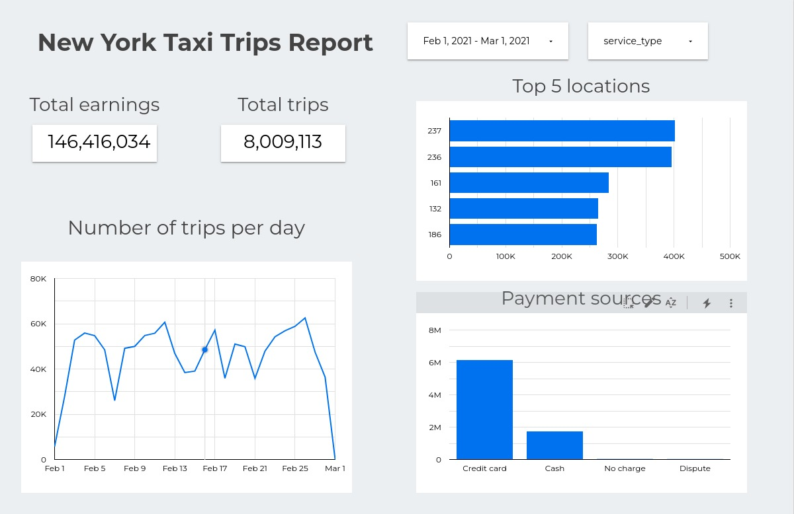

# Project 1
## Intro
#### I am using Terraform, GCP, Prefect
#### This project is based in https://github.com/DataTalksClub/data-engineering-zoomcamp

The idea is to extract some parquet files from the "New York City TLC Trip Record Data" thats publicly available from this link https://www.nyc.gov/site/tlc/about/tlc-trip-record-data.page
https://d37ci6vzurychx.cloudfront.net/trip-data/yellow_tripdata_2022-01.parquet

Firstly, i will extract the files and load them in a Data Lake (GCS). 
Then, i will add that data into a Data Warehouse (BigQuery). 
After some transformations made to the tables in BigQuery, 

I will be using Terraform to set up the infrastructure in GCP.

## Steps:
#### 1- Create a venv and install requirements.txt
#### 2- Set up terraform:
    -Using  main.tf and variables.tf 
    -Run the commands terraform init and terraform apply
#### 3- Use the ETL_2 folder to upload the data:
    -First run prefect orion start on the terminal to run prefect
    -Then with web_to_gcs.py (loads the data from the web into a Data Lake)
    -At Last with gcs_to_bg.py (loads the data from the Data Lake to BigQuery)
#### 4- Run the .sql queries located in the BigQuery folder
    - I do  this to simulate the week 4 of the zoomcamp, i didnt wanted to use dbt.
    - This could be done with some other pipelines but for simplification i did it this way.
#### 5- Visualize using Google Data Studio
    -Here are some examples i came out with:

